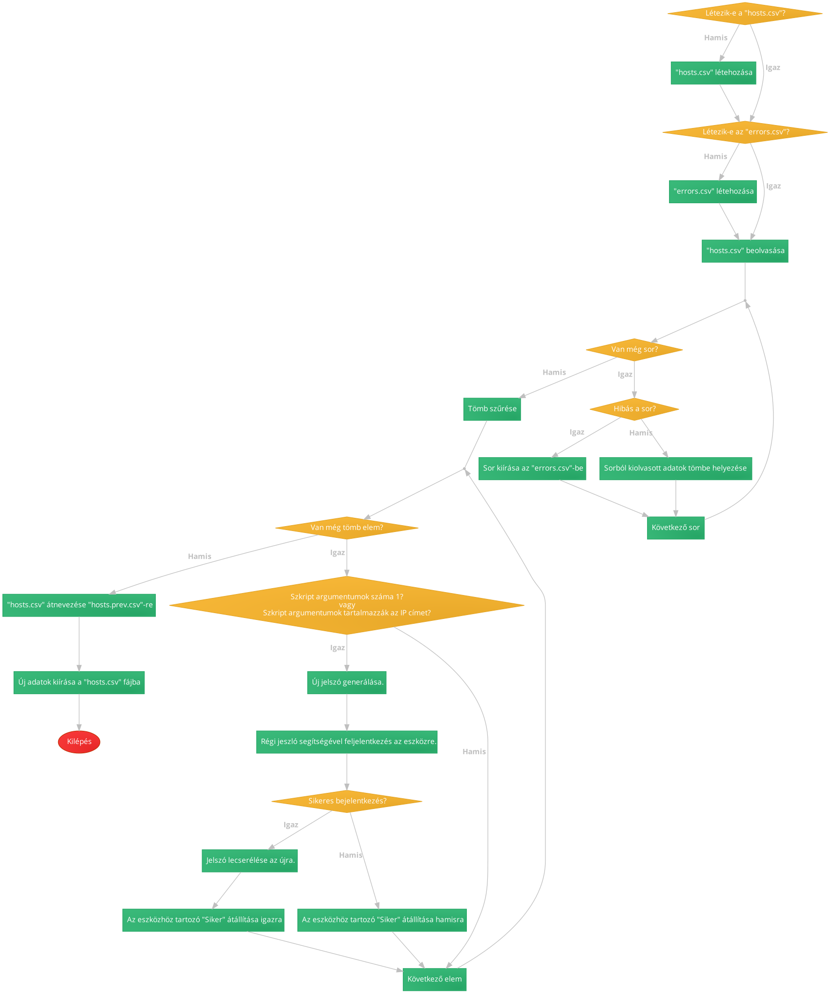

# **Replace Password** script

### Működés
1. A program beolvassa **hosts.csv**-ből a host-ok SSH-n kersztül történő eléréséhez szükséges adatokat.
2. Ha valamelyik sor a fájlban helytelen, akkor kiírja azt az **errors.txt** fájlba és tovább halad a következő bejegyzésre.
3. Generál egy 16 karakter hosszú jelszót.
4. Fellép az eszközökre és lecseréli az SSH jeszót az újra, majd menti a konfigurációt.
5. A jelenlegi **hosts.csv**-t átnevezi **hosts.prev.csv**-re és kiírja a frissített adatokat egy új **hosts.csv** fájlba.

### Hosts CSV fájl
A fájl a következő adatokat tárolja `;`-vel elválasztva:
- `"host"`\
Eszköz IP címe.
- `"port"`\
SSH port száma.
- `"user"`\
SSH felhsználó neve.
- `"pass"`\
SSH felhsználó jelszava.
- `"secret"`\
Az eszköz enable leszava.
- `"success"`\
Sikeres volt-e a legutóbbi jelszó csere.

### Anacron
A program havi rendszerességgel fut az anacron segítségével.

### Folyamatábra

